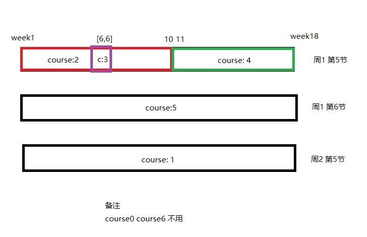

# jw06数据

## input-illegal问题

https://shimo.im/docs/293DVZBEeBuLFRk4/read

文档提到：

> ...... 可用`Input illegal.`等价代换。\
未提到的错误类型中，也做了兼容处理，为了不漏题不展示出。\
关于哪些可以代换：\
逻辑不明确或模糊的错误\
不唯一的错误。比如登录时，密码错误，属于逻辑唯一的错误，不可代换。\
简而言之，逻辑明确的错误不可代换

所以，测试数据应该对文档中难以界定的错误，采用`input-illegal`。

## jw06.yml
本文件未包含：
- 特别偏的测试，例如`[10001,]`
- 缺少参数、参数错误

## jw06-arg.yml
缺少参数、参数错误的测试

### 阅读测试数据

可以借助下图来更好的理解测试数据

课程的关系如图:
